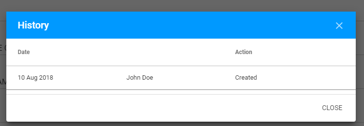
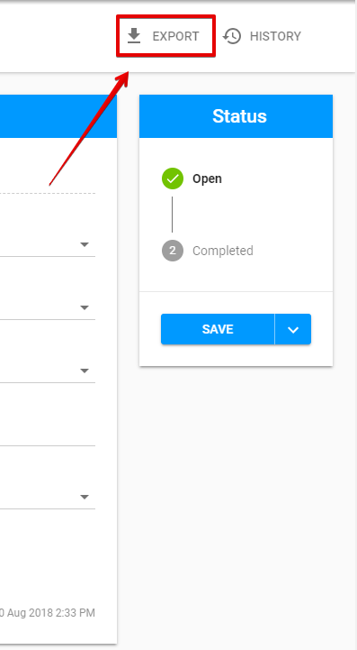

# Additional options for Action Points

## **History**

There is an opportunity to view History for modified Action Points.

**Last modify** is displayed in the bottom of Action Points Details:

The **whole history** can be opened via "History" button above the status panel:

  
And can be viewed in the following modal window:

## Export

Each Action Point can be exported to a **CSV** file.

The option is accessible via "Export" button above the status panel:

  
  

  

