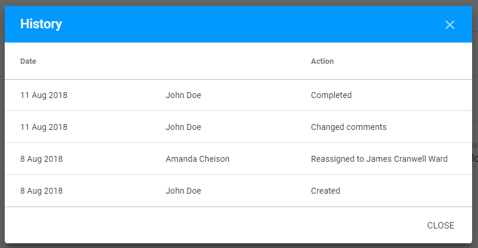

# Additional options for Action Point

## **History**

For the modified APs user has an opportunity to view the History of modifications. 

At the bottom right corner of the APs Details window, user can see the **Last modify** information: name of the user and date of the Last modification. 

The **whole history** of modifications can be opened via "History" button above the status panel:

In **History** user can see:

* date, when changes were made
* person, who made the changes
* type of changes, that were made

Here is overall view of the **History** modal window:

## Export

Each AP can be exported to a **CSV** file.

The option is accessible via "Export" button above the status panel:

  
  

  

