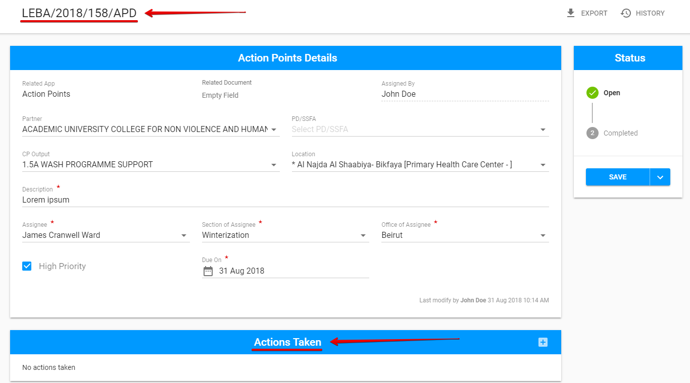
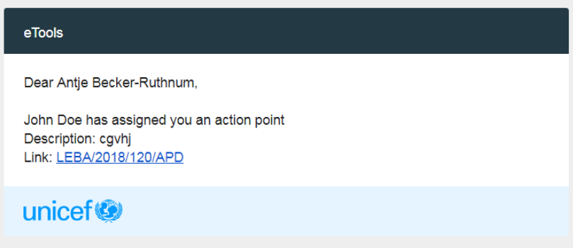
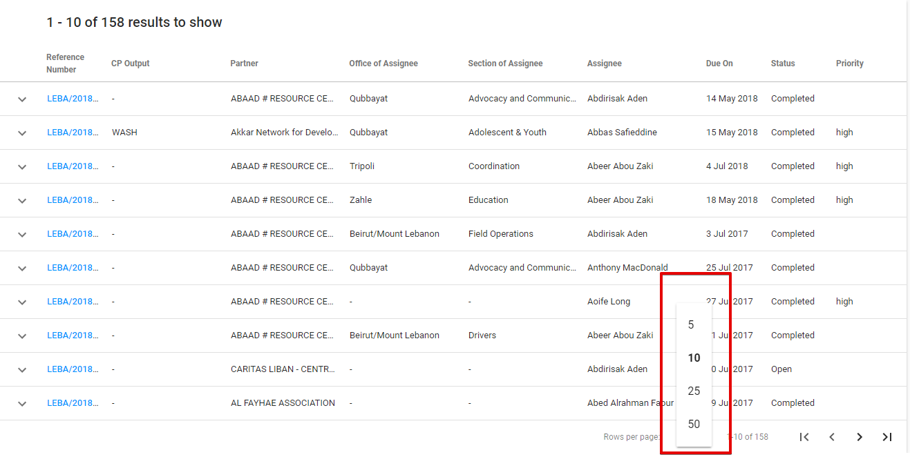
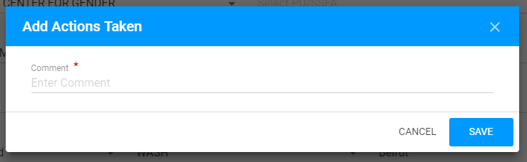
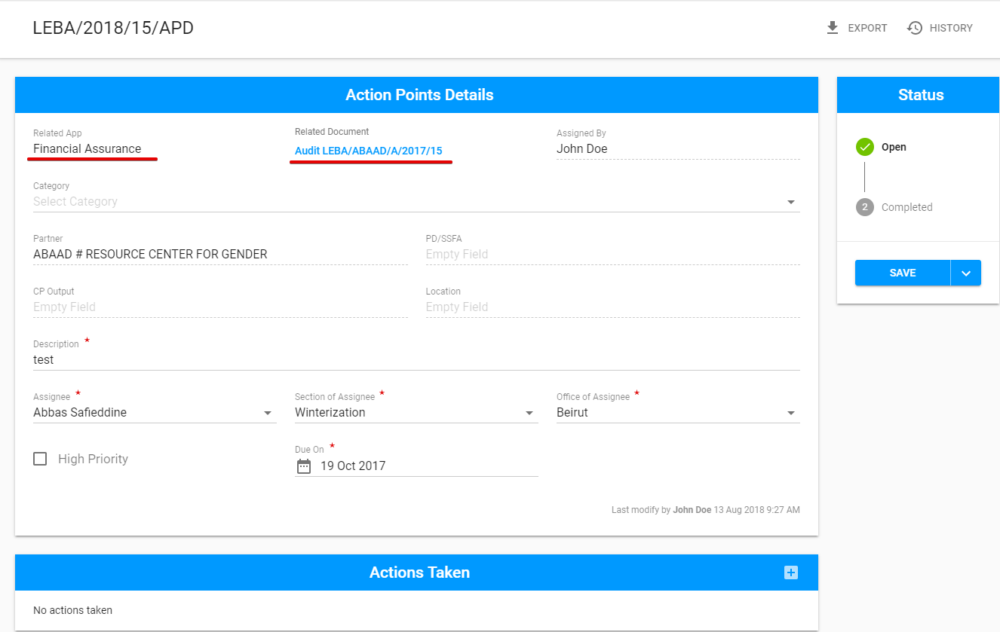

# How to modify the Action Point?

The screen for created AP has the reference number of the created Action point in the title and the additional section “Actions Taken”.

**"Save"** button with the additional option for [completion](how-to-complete-the-action-point.md) is displayed in the bottom of the status panel. 

Created Action point can be modified, viewed and completed by users with [the corresponding permissions](../untitled/user-roles-and-permissions.md).

## Email

Once the Action point was created or Assignee was changed while editing the following email of assigned action point is sent to the Assignee:

## Actions Taken 

Adding Actions Taken is available in the following modal window opened via "+"  button:

## Action Points created in other modules

The Action Points Details screen for the action points created in other modules has some differences:

* The corresponding name of module is displayed in the Related app field;
* Related Document field includes link to the task related to the Action point.

  

