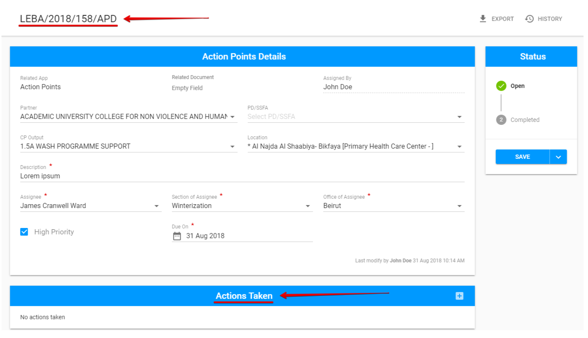

# Modification of Action Point

Here is the overall user interface for the created AP:

Each created AP has the reference number, which can be found in the top left corner of the screen, right under the header.

Also, new section called "**Actions Taken**" appears under the APs Details. This section is required. The user has to fill in at least one Action Taken in order to be able to complete the AP. 

**"Save"** button with the additional option for [completion](how-to-complete-the-action-point.md) is displayed at the bottom of the status panel. 

Created AP can be modified, viewed and completed by users with [the corresponding permissions](../untitled/user-roles-and-permissions.md).

## Actions Taken 

User can add Actions Taken using the "+"  button in the corresponding section:  

After user clicks on this button, new modal window will appear, where user can write comments about the actions, that were taken in order to fulfill the AP requirements:

## APs created in other modules

The APs Details screen for the APs that were created in other modules has some differences:

* The corresponding name of module is displayed in the Related app field;
* Related Document field includes link to the task, associated with the AP.


For AP created in action points dashboard, Related Document field will be empty. 


\_\_

  

