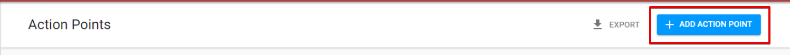

# How to add the Action Point?

User can add new action point using the correspong button in the top right corner of the Action Points screen.   

After user clicks on this button, following screen will appear:

There are 2 parts displayed on the screen: 

* **Action Points Details:** to fill in all the necessary information regarding the action point.
* **Status panel** that displays current AP status and has "Create" button.

For the action point user can specify the following data using the corresponding fields: 

* IP information \(Partner, PD/SSFA, CP Output, Location\),
* Description,
* Assignee information \(Assignee, Section of Assignee, Office of Assignee\),
* Due date.

Data for some of these fields is presented as drop-down list and user can navigate inside these lists with the help of **Search** function, that is available for each drop-down list:

User can indicate the priority level for action point by selecting the **high priority** checkbox.

When all required information is entered, the user can press "Create" button at the bottom of the status panel.

  
****In case of successful creating the user will be moved to the [next screen](created-opened-action-point.md) with the reference number of the created Action point in the title and the additional section “Action Taken”.

