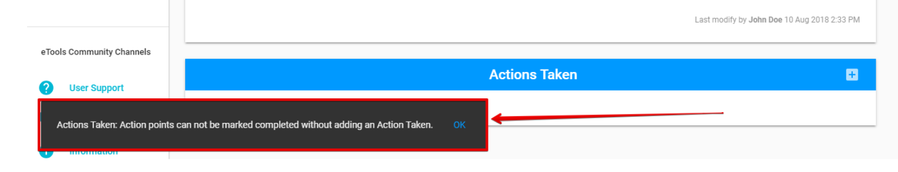
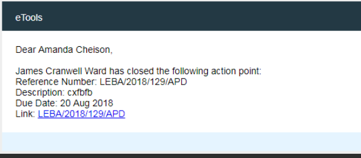

# Completion of AP

The created action point can be completed by users with [the corresponding rights](../untitled/user-roles-and-permissions.md).

The **"Complete"** option is accessible in the drop-down list of the split button "Save".

User can complete the Action point only in if at least one **Action Taken** is added. See [How to modify the Action Point? ](created-opened-action-point.md)article for more details of the Actions Taken section. 


If no Actions Taken are added, the following error message will be displayed:


The whole Action Points Workflow you can find [here](../action-points-workflow.md).

## Email notification

Once the action point is completed, user, who is **Assigned by**,  will receive the following email:

