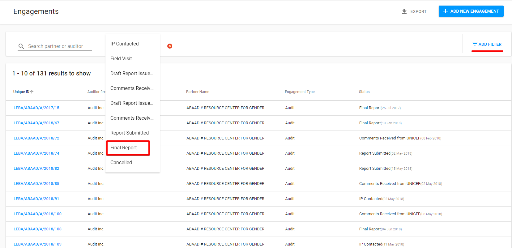
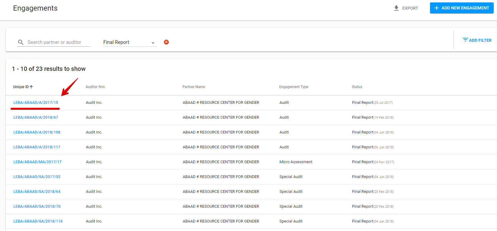
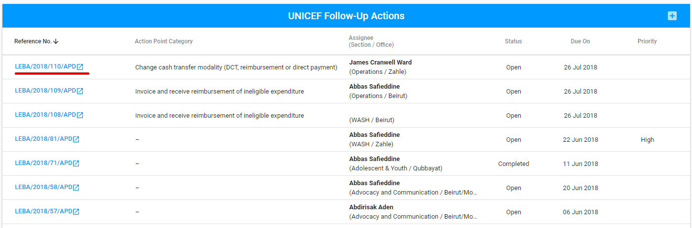

# Action Points in FAM

## AP list in the FAM

In the FAM user can access the Action points list through the following steps:

1. Select "Engagements" section in the left navigation panel:

     2. Filter Engagements by the "Final Report" status:

      3. Click the reference number for the particular row to open the engagement:

      4. Select "Follow-up" tab:

        5. The section "UNICEF Follow-Up Actions" will be displayed in the "Follow-up" tab:


The UNICEF Follow-up Actions section is the Action Points list in FAM.


## User rights

The spreadsheet below describes the user roles and rights for AP in FAM.

## Creation and modification of the AP in FAM

**Creation:** via "+" button in the upper, right-hand corner of the UNICEF Follow-Up Actions section:

**Modification:** via "Edit" button at the end of the row with the particular AP:

There is an additional option for **duplication** of ****the AP at the end of each row behind the "Edit" button: 

Creation and modification of AP are provided in the modal windows with the similar fields as [in case of the APD](../action-points-screens-1/how-to-add-new-action-point.md).

The difference is that "Related partner" field is filled in accordance with the engagement partner by default and is non-editable.

## Completion of the AP in FAM

User can complete the AP which is created in the FAM by using the **APD**. 

Clicking the reference number of the particular AP takes the user to the AP details in APD.

 The AP details screen for the AP, created in FAM, has some differences:

* The corresponding name of module is displayed in the Related app field,
* Related Document field includes link to the task related to the Action point.


Modification of the AP, created in the FAM, is available in the APD as well.


