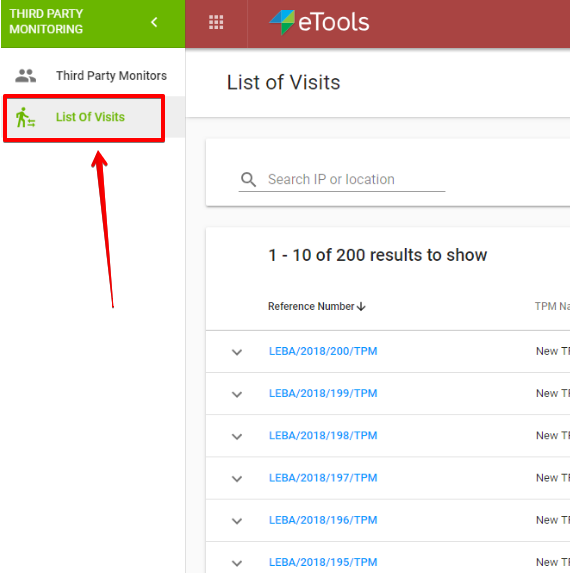
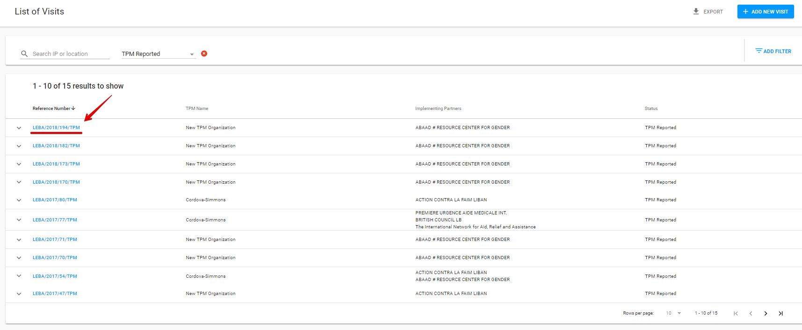
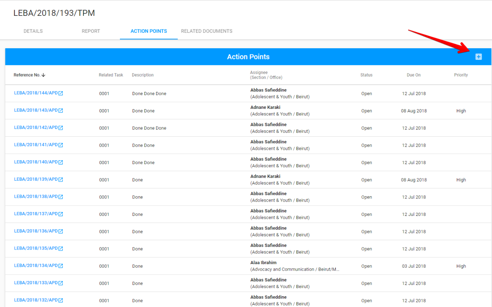
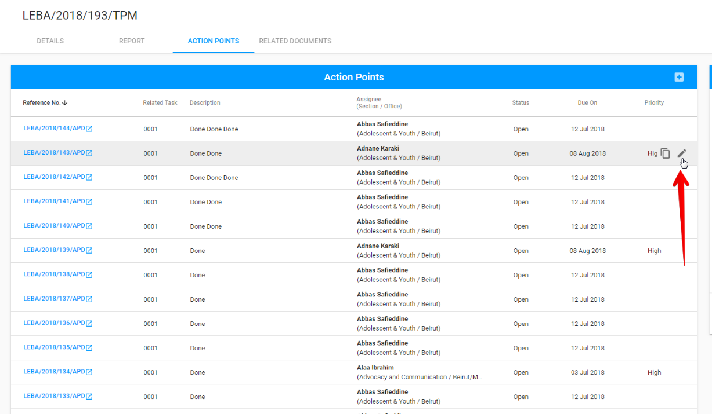
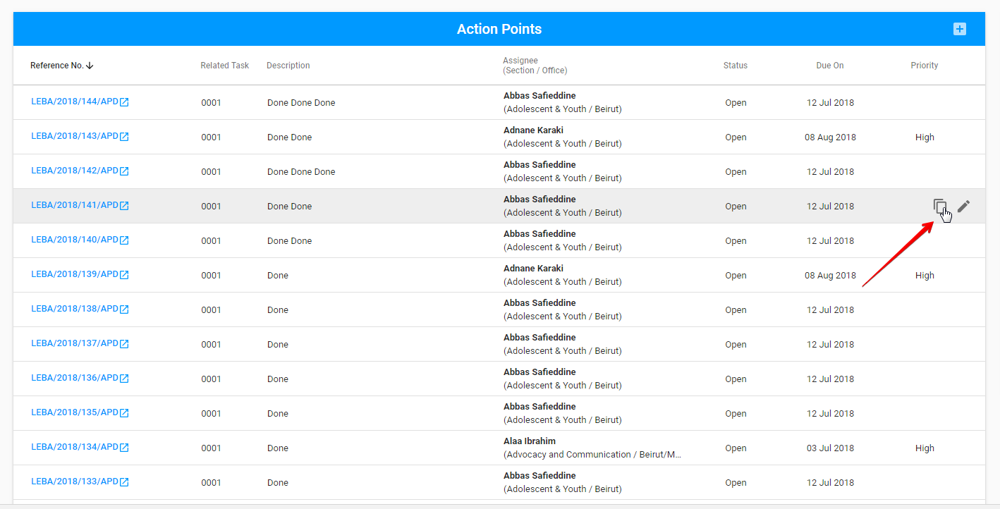
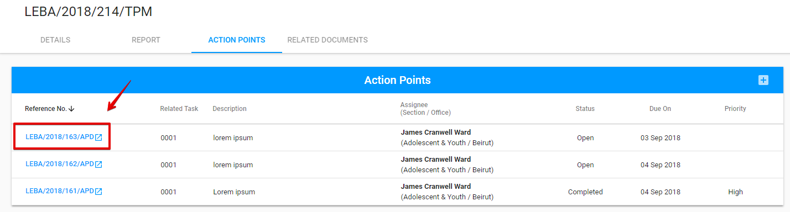

# Action Points in TPM

## **AP list in TPM**

In the TPM user can access the APs list through the following steps:

1. Select List of Visits in the left navigation panel: 

   

2. Filter list by clicking "Add Filter" button in the top right corner of the screen and selecting the required Status filter  \("TPM Reported" or "UNICEF Approved"\); 
3. Click the reference number for the particular row to open the visit: 

    4. Choose APs section at the page with opened visit:

## User rights

The spreadsheet below describes the user roles and rights for AP in TPM.

## Modification of the AP in TPM

**Adding:** via "+" button in the upper, right-hand corner of the list of APs:

**Modifying:** via "Edit" button in the end of the row with particular AP \("Edit" button appears after user hover the mouse over the particular line from the APs list \)::

There is an additional option for **duplicating** the AP in the end of each row behind the "Edit" button:

Adding and modifying are provided in the modal screen with the similar options as [in the APD](../action-points-screens-1/how-to-add-new-action-point.md). 

The difference is that Related partner field is filled in accordance with the Visit partner and displayed in the AP details **after the creation**. 

## Completion of the AP in TPM

User can complete the AP which is created in the TPM  by using the **APD**. 

Clicking the reference number of the particular AP takes the user to the AP details in APD.

The AP details screen for the AP which is created in the TPM has some differences:

* The corresponding name of module is displayed in the Related app field,
* Related Document field includes link to the task related to the Action point.


Modification of the AP,  created in TPM,  is available in the APD as well.


  

  

