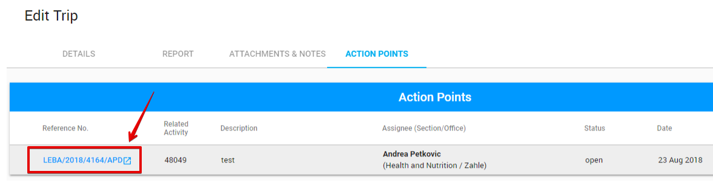

# Action Points in Trip Management \(T2F\)

## **How to access the APs list in the T2F?** {#how-to-access-the-aps-list-in-the-tpm}

In the T2F user can access the Action points list through the following steps:

1. Click the reference number for the particular row to open the trip in the List of Trips:

       2. Choose "Action point" section:

## User rights {#user-rights}

The spreadsheet below describes the user roles and rights with AP in T2F.

## How to add and modify the AP in the T2F? {#how-to-create-and-modify-the-ap-in-the-tpm}

**Adding:**  via "+" button in the upper, right-hand corner of the list of APs:

**Modifying:** via "Edit" button in the end of the row with particular AP:

There is an additional option for **duplicating** the AP in the end of each row behind the edit button:

The creation and modification are provided in the modal window with the similar options as [in the APD](https://new-company.gitbook.io/action-points-dashboard/~/drafts/-LJsEypD-Q6kFSj9_L1b/primary/product-end-user-documentation/action-points-screens-1/how-to-add-new-action-point).

The difference is that the Related partner field is filled in accordance with the Trip partner and displayed in the AP details **after the creation**. 

## How to complete the AP in the T2F? {#how-to-complete-the-ap-in-the-tpm}

User can complete the AP which is created in the T2F  by using the **APD**. 

Clicking the reference number for particular AP takes the user to the AP details in APD.

 The AP details screen for the AP created in the T2F has some differences:

* The corresponding name of module is displayed in the Related app field,
* Related Document field includes link to the task related to the Action point.


Modification of the AP, created in the T2F, is available in the APD as well.


