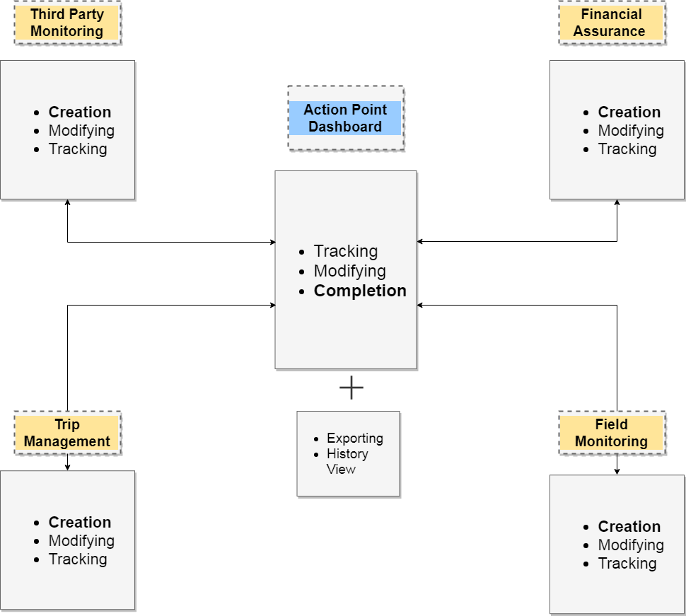

# Overview

There are 2 types of Action Points that can be created in eTools:

1. not associated with eTools Module
2. associated with eTools modules \(TPM, FAM, FM \(TBD\), T2F\).

All Action Points can be tracked in the APD.


Action Points can be filtered by the Related App for easy tracking of the related to other modules Action Points. 


  

