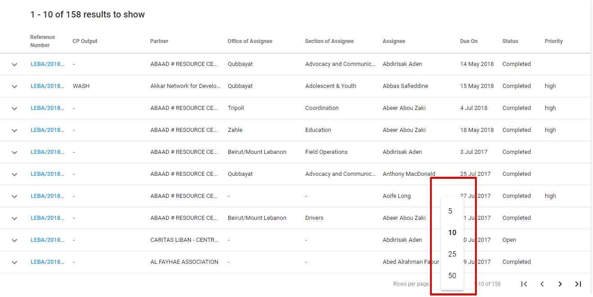

# List of Action Points

List of Action Points contains all of the AP, no matter how they were created - using the APD or any other module \(TPM, FM \(TBD\), AP, T2F\). By default, user sees both open and completed Action Points, but it can be changed using the switcher in the top right corner, that allows to disable displaying of the completed AP. 

**Action Point overview** can be quickly opened using the arrow behind the reference number. Here user can find most of the information regarding the chosen AP. 

Clicking the reference number for each row will take user to the corresponding **Action point Details**. The detailed information of Action Points Details screen see [here](action-points-screens-1/created-opened-action-point.md).

User can choose the **number of the displayed Action Points per page**, it can be selected in the following dropdown field \(the default value is 10 rows per page\):

User also can **sort columns** in either ascending or descending order.

## Export

The List of Action points can be exported to **CSV** file using the "Export" button in the upper right-hand corner. 

## **Searching**

User can search through the AP, and the search can be perfomed for a variety of the fields, e.g.  CP Output, Partner, Office of Assignee, Section of Assignee, Assignee, Status, Priority.

## Filtering

In the upper right-hand corner the user can use "Add filter" option with set of parameters to be chosen.   
List can be filtered using the different kinds of filters: Assigned By, Assignee, CP Output, Due After, Due Before, Due On, High Priority, Location, Office, Partner, PD/SSFA, Related App, Section, Status.

After the user selects the required filter from the Filters list, field with the droprown list of options and search fuction appears on the left side: 

**Example:**  Filter “Assigned by “ is selected: 

  
****

