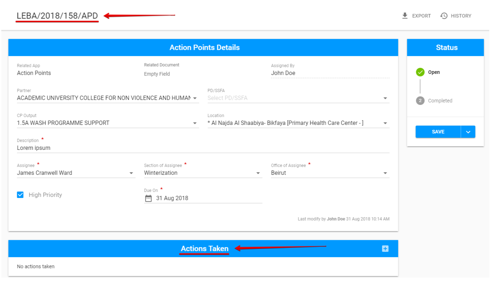
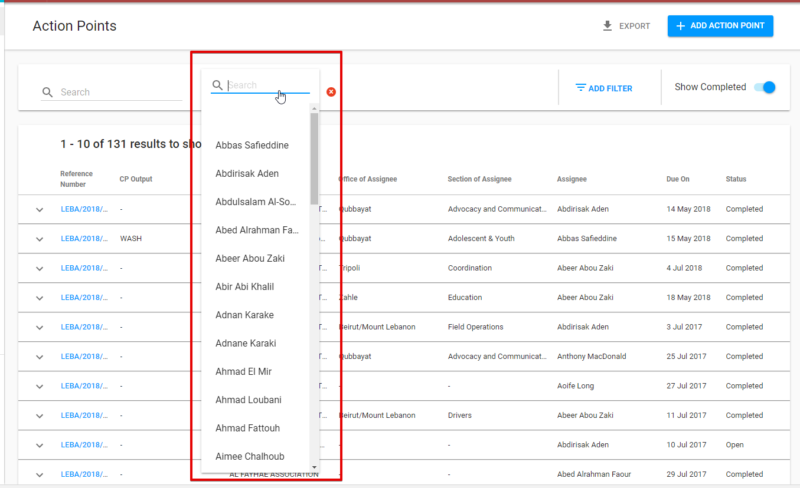

# List of Action Points

Filterable list of the Action points created as New in the current module or in the TPM, FM \(TBD\), AP, T2F modules. By default the **opened** and **completed** Action points are shown. The user can change the status  as desired.

Additional set of data for each row  can be opened via arrow behind the reference number.

Each row can be **sorted by columns** in either ascending or descending order.

Displayed rows in the table can be **limited per page**.  The default is 10 rows per page.

Clicking on the reference number for each row will take user to the corresponding Action point Details. The detailed information of Action Points Details screen see [here](action-points-screens-1/created-opened-action-point.md).

## Export

The List of Action points can be exported to **CSV** file by "Export" button in the upper, right-hand corner. 

## **Searching**

The user is able to use the search bar in the upper, left-hand corner to execute a data search.  ****

## Filtering

In the upper, right-hand corner the user can use "Add filter" option with set of parameters to be chosen.

The additional search field appears behind search bar after particular filter parameter has been selected.  

**Example:**  Filter “Assigned by “ is selected: 

There is additional short cut for status sorting which is provided by “Show completed” switcher behind "Add filter" option.  The switcher is "ON" by default. 

  
****

