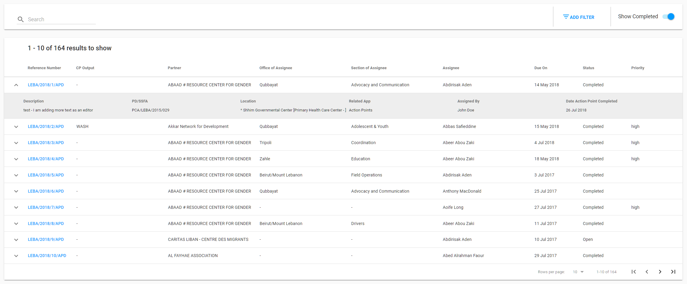

# Overall User Interface

The overall UI of the APD is presented in the screenshot:

The following sections are represented for overall UI:

**Header** with:

* reload icon,
* profile dropdown,
* country dropdown,
* app icon to switch to another application  or repository.

**Сollapsible left navigation panel**  with:

At the top:

* label with the module name,
* APs section.

At the bottom:

* eTools Community Channels \("Knowledge Base", "Discussion", "Information"\)

**List of APs** is the main element on this page:

This list provides the ability to manage all of the created APs: open details of the specific AP or quickly see its overview. Detailed description of the AP list can be found [here](https://razortheory.gitbook.io/action-points-dashboard/~/edit/drafts/-LM2Q6TpT0_6f2a9VRTq/product-end-user-documentation/list-of-action-points)

