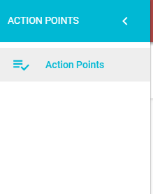

# Overall user Interface

Here is the overall user interface of Action Point Dashboard:

**Header** with:

* reload icon,
* profile dropdown,
* country dropdown,
* app icon to switch to another application  or repository.

**Сollapsible left navigation panel**  with:

In the top:

* label,
* Action Points section.

In the bottom:

* eTools Community Channels \("User support", "Discussion", "Information"\)

