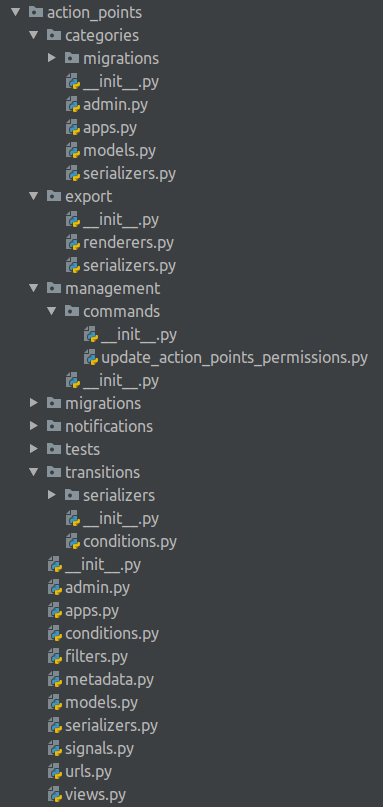
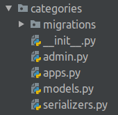

# Backend module structure

### Action Points module files structure {#audit-module-files-structure}

- `categories` - nested global application to store list of available categories for action points  
- `export` - everything that is related to csv & pdf exports  
    - `renderers.py` - csv renderers  
    - `serializers.py` - csv & pdf serializers  
- `management` - specific management commands. in our case there is only one command for updating permissions.  
 -`migrations` - database migrations  
- `notifications` - templates for email notifications  
- `tests` - tests for models, views, serializers, transitions flow  
- `transitions` - everything that is related to fsm transitions  
    - `conditions.py` - custom checks for transitions. for example in case of submitting report we need to be assured that report attachments are exists.  
- `admin.py` - admin site definitions for models  
- `apps.py` - python app configuration  
- `conditions.py` - conditions to perform FSM transitions. [see more details here]()  
- `filters.py` - rest framework views filters  
- `metadata.py` - base metadata class to be used in viewsets. more in [API Metadata section]()  
- `models.py` -  country-related audit models  
- `serializers`- rest framework serializers  
- `signals.py` - app signals. custom logic for user deletion; sending notifications in case of assigning action points  
- `urls.py` - app urls  
- `views.py` - just set of views to work with models

### action\_points.categories app

To store action points categories which are global, was implemented nested application named `categories`.   
Views and serializers are still placed in parent application to keep consistant place for all module logic.

App consists of:  
- `migrations` - database migrations  
- `admin.py` - admin site config  
- `apps.py` - python app config  
- `models.py` - partner with their staff members  
- `serializers.py` - rest framework category serializer

