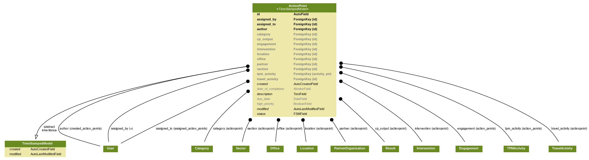

# Data Model

The high-level conceptual data model for the product is presented below. It is designed to provide the common mechanism to track action points, coming from all modules. Currently Action Point can be linked to Financial Assurance, Third Party Monitoring and Trip Management modules with corresponding model relations.

Action Point can belong to only one module and this relation can't be changed later. Correspondingly, links to Partner, PD/SSFA, CP Output, Location, Category, Section and Office can be added to provide some additional context.

